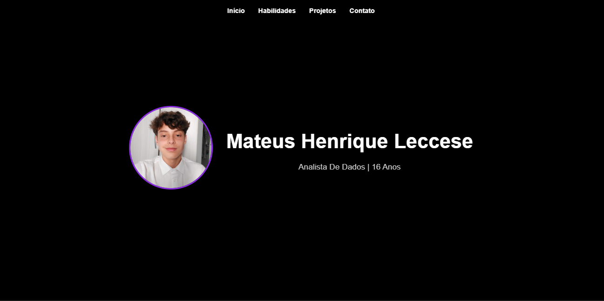
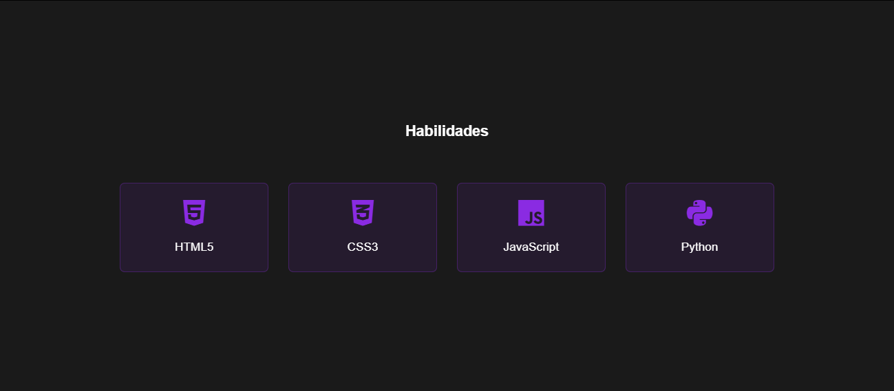
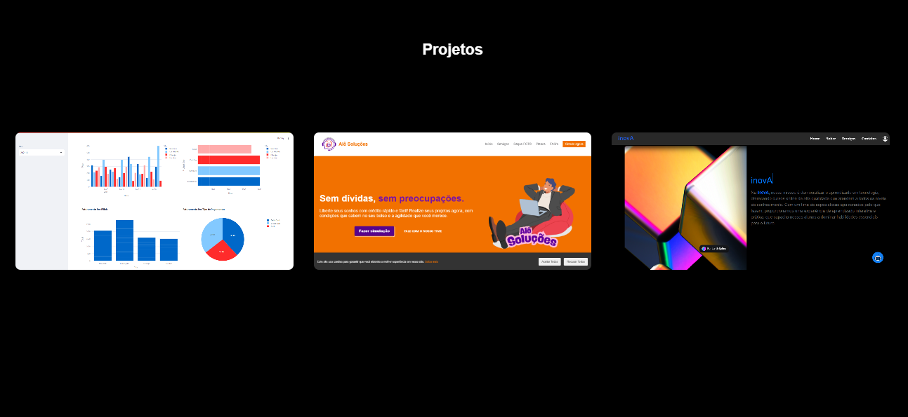
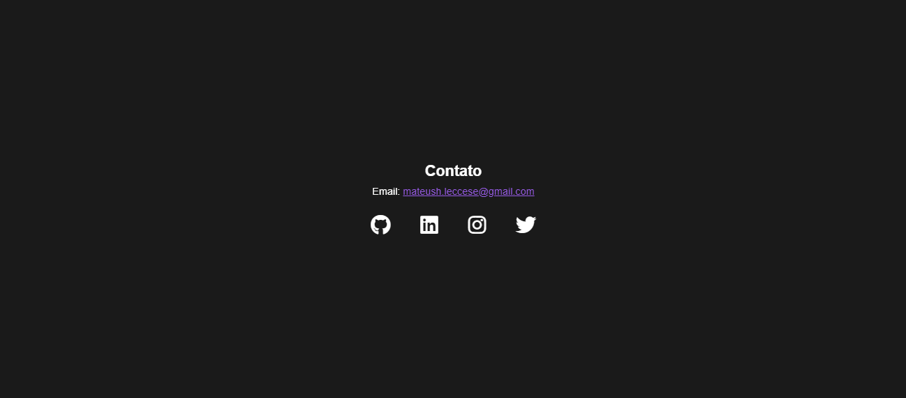

# Portfólio Pessoal - HTML, CSS e JavaScript 👻

Bem-vindo ao meu repositório de portfólio pessoal! Este projeto foi desenvolvido para exibir minhas habilidades.

## 🚀 Recursos do Projeto

- **Design Moderno e Responsivo**: Layout adaptável para diferentes dispositivos (desktop, tablet e mobile).
  
  - **Seções Organizadas**
  - **Início**
  - **Habilidades**
  - **Projetos**
  - **Contato**

## 🛠️ Tecnologias Utilizadas

- **HTML5**: Estruturação do conteúdo.
- **CSS3**: Estilização e animações.
- **JavaScript**: Interatividade e scroll suave.
- **Font Awesome**: Ícones para habilidades e redes sociais.

## 📁 Estrutura do Projeto

```
portfolio/
├── css/          # Estilos CSS para o design e animações
│   ├── contato.css          # Estilo CSS para usuarios me contactarem
│   ├── habilidades.css          # Estilo CSS para introduzir minhas habilidades
│   ├── header.css          # Estilo CSS para o design do header do site
│   ├── home.css          # Estilo CSS para apresentar a parte inicial do site
│   ├── projetos.css          # Estilo CSS para apresentar projetos
│   ├── reset.css          # CSS para resetar padrões dos navegadores
│   └── section.css          # Estilo CSS para seção
│
├── img/             # Pasta para imagens e ícones
│   ├── foto.jpg    # Imagem de perfil
│   ├── projeto1.jpg    # Imagem do Projeto 1
│   ├── projeto2.jpg    # Imagem do Projeto 2
│   └── projeto3.jpg    # Imagem do Projeto 3
│
│
├── js/
│   └── script.js       # Scripts JavaScript para interatividade
│
│ 
└── index.html          # Página principal do portfólio
```

## 🎨 Design

O design é minimalista, com uma paleta de cores baseada em **preto e roxo**, proporcionando um visual moderno e sofisticado. As animações e efeitos hover foram cuidadosamente implementados para destacar interações importantes.

## 🚀 Como Executar o Projeto

1. Clone o repositório:
   ```bash
   git clone https://github.com/mateus-henriquee/portfolio.git
   ```
2. Abra o arquivo `index.html` no seu navegador.

## 🌐 Acesso Online

O projeto está hospedado no GitHub Pages. Acesse: [Link do Portfólio](vercelllll)

## 📸 Screenshots

### Início


### Habilidades


### Projetos


### Contato


## 📄 Licença

Este projeto está licenciado sob a licença MIT. Veja o arquivo [LICENSE](LICENSE) para mais detalhes.

---

## 💡 Contribuições

Contribuições são bem-vindas! Se você tiver sugestões ou encontrar problemas, sinta-se à vontade para abrir uma **issue** ou enviar um **pull request**.

---

## 📧 Contato

Se você gostou do projeto ou quer entrar em contato, me envie um email: [mateush.leccese@gmail.com](mateush.leccese@gmail.com)

---

Espero que você goste do meu portfólio! 😊
